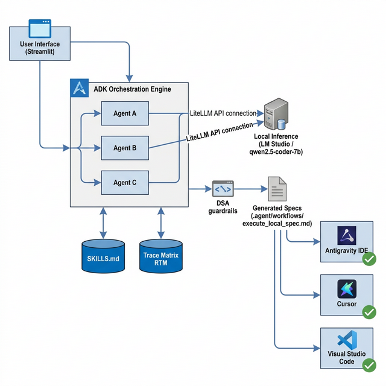

# Enterprise Local ADK Orchestrator
### Google ADK | Streamlit | LM Studio | Spec-Driven Development


A production-grade local Python orchestration pipeline utilizing Streamlit for the UI and the Google Agent Development Kit (ADK) for AI routing. This framework operates as a local "Prompt Architect" that cross-examines user requirements, manages context dynamically into a Trace Matrix, enforces enterprise coding standards (`SKILLS.md`), and generates highly structured, token-efficient markdown specifications specifically optimized to be consumed by downstream AI IDEs (Antigravity, Cursor, VS Code) for generation.

---

## Architecture

<p align="center">
  
</p>

---

## Key Features

| Layer | Feature | Detail |
|-------|---------|--------|
| **Interface** | Streamlit Real-Time Chat | Streamed inference tokens with sliding window arrays keeping memory restricted to the System Prompt + last 4 turns. |
| **Logic** | Multi-Agent Hub | Routing requests between Agent A (Clarifier), Agent B (Optimizer), and Agent C (Auditor) via API. |
| **State** | Trace Memory | User requirements are explicitly captured into `rtm_state.json` avoiding context loss. |
| **Governance** | Enterprise Standard Guardrails | Constrains LLM outputs strictly to rules parsed from the static `SKILLS.md` registry. |
| **Validation** | DSA Compliance Engine | Mathematical constraint engine using AST parsing over Git outputs to physically block algorithms with $O(n^2)$ time complexity. |
| **Execution** | Active Circuit Breaker | Proactive `system_io.py` stops Agent C from emitting auto-fixes without explicit `Y/N` User UI override. |

---

## Tech Stack

| Layer | Technology | Purpose |
|-------|-----------|---------|
| **Frontend** | Streamlit | Real-time chat & spec preview dashboard |
| **Orchestration** | Google ADK & Python | Defines modular Clarifier, Optimizer, and Auditor tools |
| **LLM Gateway** | LiteLLM | Normalizes API requests to the physical local LLM |
| **Local Inference** | LM Studio (`qwen2.5-coder-7b`) | VRAM-loaded inference execution running zero cloud cost |
| **Rule Engine** | `ast` and Python Subprocess | Git diff structural evaluation against time-complexity limits |
| **Output Intercept** | Markdown (`.md`) Specs | Bridging files generated explicitly for downstream AI context windows |

---

## Project Structure

```
local-adk-orchestrator/
|-- src/                           # Core operational python modules
|   +-- app.py                     # Streamlit frontend, chat loop, circuit breaker UI
|   +-- orchestrator.py            # ADK and litellm routing layer (Agents A, B, C)
|   +-- dsa_engine.py              # Big-O mathematical guardrails & DAG evaluator
|   +-- system_io.py               # Audit log reader and file system operations
|-- build_logs/                    # Temporary testing artifacts evaluated by Auditor
|-- .agent/workflows/              # Forward-handoff spec generation bay
|   +-- execute_local_spec.md      # Final output consumed by downstream IDEs
|-- docs/                          # Documentation and diagramming
|   +-- architecture.png           # Blueprint rendering
|-- SKILLS.md                      # Foundational engineering rules engine
|-- rtm_state.json                 # Auto-generated requirements trace memory
+-- .gitignore
```

---

## Quick Start

### Prerequisites
- Python 3.9+
- Local local LLM setup instance (e.g. LM Studio running `qwen2.5-coder-7b` actively rendering to `http://localhost:1234/v1`)
- Git CLI

### 1. Project Initialization
```bash
python -m venv venv
# Linux/macOS
source venv/bin/activate 
# Windows PowerShell
.\venv\Scripts\activate

pip install streamlit google-adk litellm gitpython
```

### 2. Launch Local Environment
Starting the Streamlit UI immediately boots the system bindings.
```bash
streamlit run src/app.py
```

---

## Agent Data Flow

```
User (Streamlit UI) --> Converses dynamically 
  --> Agent A (Clarifier) refines facts
    --> `rtm_state.json` saves constraints
      --> Agent B (Optimizer) builds Spec
        --> IDE Consumes Markdown into Code
          --> Test Cases fail & hit `build_logs/`
            --> Agent C (Auditor) parses AST git diff
              --> Circuit Breaker (UI confirms fix approval)
```

---

## Guardrails & Complexity Enforcement

Agent C (The Auditor) triggers independent evaluations checking structural commits over simply matching code diffs:
1. Validates standard `pytest` coverage execution
2. Reconstructs git additions physically checking for inner nested-loop complexity flags via `dsa_engine.py` allowing deterministic fail states.

---

**Built by [Ragotham Kanchi](https://github.com/Ragotham1209)**
