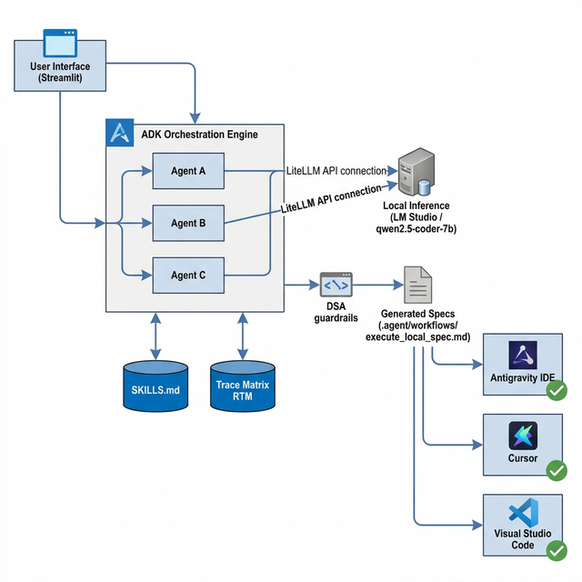

# Local ADK Orchestrator

A local Python orchestration pipeline utilizing Streamlit for the UI and the Google Agent Development Kit (ADK) for AI routing. This system acts as a local "Prompt Architect" that cross-examines user requirements, manages state via a Trace Matrix, enforces coding standards via a `SKILLS.md` file, and generates hyper-optimized markdown specifications for downstream AI IDEs (Antigravity, Cursor, VS Code).

## System Architecture


## Core Components
* **Extracted Trace Memory:** Saves state iteratively as users converse with Agent A to `rtm_state.json`.
* **Knowledge Guardrails:** Forces strict Agile, Database, and Python constraints based on reading `SKILLS.md`.
* **DSA Constraints:** `dsa_engine.py` applies structural AST-parsing routines over git outputs to mathematically halt O(n^2) or worse logic regressions.
* **MANDATORY Circuit Breaker:** App-in-loop `system_io.py` halts workflows preventing silent execution of Auditor output.

## Installation & Usage

1. **Environment Setup:** Ensure Python is installed.
    ```bash
    python -m venv venv
    source venv/bin/activate  # On Windows use `venv\Scripts\activate`
    pip install -r requirements.txt # (or install directly: streamlit google-adk litellm gitpython)
    ```

2. **Inference Backend:**
    Start your local LLM inference server (e.g. LM Studio) and ensure `qwen2.5-coder-7b` is active and listening on `http://localhost:1234/v1`.

3. **Launch the UI:**
    ```bash
    streamlit run app.py
    ```
